<!-- ========================================================= -->
<!--                       PROJECT BANNER                      -->
<!-- ========================================================= -->

<p align="center">
  
</p>

<h1 align="center">PIC18F4520 Software UART (Bit-Banging)</h1>
<p align="center"><i>A deterministic, interrupt-driven UART TX/RX implementation using Timer0 and External Interrupt 2, built entirely in software without hardware UART.</i></p>

---

<!-- ========================================================= -->
<!--                           BADGES                           -->
<!-- ========================================================= -->

<p align="center">
  
  
  
  
  
  
</p>

---

# ⭐ Project Overview

This firmware implements a **software UART (bit-banged UART)** on the **PIC18F4520** microcontroller.  
It does **not** use the PIC hardware USART peripheral. Instead, UART timing and protocol framing are generated manually via:

- **Timer0** (8-bit mode) for bit timing  
- **External Interrupt 2 (INT2)** for start-bit detection  
- **GPIO toggling** for TX/RX  
- **Interrupt-driven TX/RX state machines**  

This design is useful when:
- Hardware UART is unavailable or already in use  
- You want deterministic low-level control  
- You want to understand how UART works electrically & temporally  

This project uses:
- `RD0` → TX output  
- `RB2` → RX input (via INT2)  

The system performs:  
➡ Detect start bit → sample 8 bits → echo back the received byte → send stop bit.

---

# 🧩 Firmware Architecture

The implementation consists of three major components:

## 1️⃣ **Interrupt Service Layer (isr.c)**  
Handles INT2 and TMR0 interrupts:

- INT2 triggers on **falling edge**, marking the start bit  
- Timer0 generates **bit-period** aligned tasks for TX/RX  

Referenced from `isr.c`:  
:contentReference[oaicite:0]{index=0}

---

## 2️⃣ **UART Bit-Banging Engine (uart_banging.c)**  
Implements the actual UART frame:

- Start bit  
- 8-bit payload (LSB first)  
- Stop bit  

Referenced from `uart_banging.c`:  
:contentReference[oaicite:1]{index=1}

This module contains:
- TX state machine  
- RX state machine  
- Payload shifting logic  
- Half-bit wait to sample at center of the bit  

---

## 3️⃣ **System Initialization (main.c)**  
Configures:

- GPIO  
- Timer0  
- External interrupt 2  
- Global interrupt enable  

Referenced from `main.c`:  
:contentReference[oaicite:2]{index=2}

---

# ⚙️ UART Bit-Level Timing

The UART frame structure (8-N-1):

Start Bit | 8 Data Bits (LSB → MSB) | Stop Bit


### Timing is controlled by:

- `BIT_PERIOD`  
- `HALF_BIT_PERIOD`  

Defined in `main.h`:  
:contentReference[oaicite:3]{index=3}

Timer0 reload values generate exact baud timing.

---

# 🧠 System Flow (Professional Breakdown)

---

# 1️⃣ **RX Path — Start Bit Detection → Half-Bit Centering → Data Sampling**

When RX line (RB2) detects a falling edge:

1. INT2 ISR fires  
2. RX state switches to **RECIEVE**  
3. Timer0 is configured with **HALF_BIT_PERIOD**  
4. After half-bit delay, sampling aligns at bit center  
5. Timer0 continues sampling 8 bits  

### RX Sequence Diagram

```mermaid
sequenceDiagram
    participant Line as RX Line (RB2)
    participant INT2 as INT2 ISR
    participant T0 as Timer0 ISR
    participant UART as uart_rx_frame()

    Line-->>INT2: Falling edge (Start Bit)
    INT2->>UART: uart_wait_halfbit()
    UART->>T0: Start Timer0 for sampling

    loop 8 Bit Samples
        T0->>UART: uart_rx_frame() → sample RB2
    end

    UART->>UART: Byte collected
    UART->>UART: Switch to TRANSMIT (Echo Back)
```



## 2️⃣ TX Path — Start Bit → Payload → Stop Bit

The TX state machine builds a complete frame:

```scss
Start bit (LOW)
Payload (LSB→MSB)
Stop bit (HIGH)
```

Driven entirely by Timer0 interrupts.

**TX Sequence Diagram:**


## 🧩 Detailed Component Documentation

**A. External Interrupt Handling (INT2)**

Handles falling edge detection for start bit.

From isr.c:

```c
if(INTCON3bits.INT2IF == 1){
    INTCON3bits.INT2IF = DISABLE;
    INTCON3bits.INT2IE = DISABLE;
    uart_wait_halfbit();
}
```

Why disable INT2?

To prevent false triggers while sampling the frame.

**B. Timer0 ISR (Bit Engine)**

```c
if(INTCONbits.TMR0IF == 1){
    if(uart_status == TRANSMIT) uart_tx();
    else if(uart_status == RECIEVE) uart_rx();
}
```

Timer0 acts as:

-Bit clock for TX

-Sampling clock for RX

**C. UART TX Engine**

From uart_banging.c:

```c
uart_start_bit();
uart_payload();
uart_stop_bit();
```

Payload logic:

```c
LATDbits.LD0 = (temp_rx >> nth_place) & 1U;
```
**D. UART RX Engine**

RX collects bits:

```c
temp_rx |= (PORTBbits.RB2 << nth_place);
```

Once 8 bits are collected:

```c
uart_status = TRANSMIT;
```

RX automatically triggers TX for echo.

**E. Half-Bit Sampling Alignment**

Critical for software UART reliability:

```c
TMR0L = HALF_BIT_PERIOD;
uart_status = RECIEVE;
```

Aligns sampling to the center of each bit.

## 🧮 Timing Diagram (Bit Banging UART)


Aligns sampling to the center of each bit.

## 📁 File Overview

| File             | Purpose                                               |
| ---------------- | ----------------------------------------------------- |
| `main.c`         | GPIO, Timer0, INT2 initialization                     |
| `isr.c`          | INT2/TMR0 interrupt logic, scheduling TX/RX frames    |
| `uart_banging.c` | Complete TX/RX state machines, timing, framing logic  |
| `main.h`         | Configuration constants, bit periods, macros          |
| `uart_banging.h` | UART function declarations                            |

## 🔬 Engineering Challenges & Solutions (Professional Insight)

**1️⃣ Clock accuracy**

Bit-banged UART is sensitive to timing drift → Timer0 reload values tuned for stability.

**2️⃣ Start-bit validation**

Falling edge IRQ alone is not reliable → half-bit delay used to sample mid-bit.

**3️⃣ Deterministic ISR execution**

All UART timing is ISR-driven (zero polling → deterministic response).

**4️⃣ RX/TX state machine management**

Separate finite-state machines ensure clean transition between RX → TX → Idle.

**5️⃣ Glitch avoidance**

INT2 disabled during frame reception to avoid false triggers

## 🧪 How to Run

1.Load project in MPLAB X IDE

2.Configure PIC18F4520 with a 20 MHz crystal

3.Connect:

    -RD0 → UART TX output

    -RB2 → UART RX input (interrupt-driven)

4.Open a serial terminal

5.Type any character

6.PIC echoes it back via bit-banged UART

## 📌 Future Improvements

-Add parity bit support

-Add configurable baud rates

-Add oversampling for noise immunity

-Add framing error detection

-Extend to 9-bit UART mode

-Implement ring buffer for TX/RX

-Add unit tests for timing validation

## 🏆 Why This Project Matters

This firmware demonstrates true low-level embedded engineering:

-Designing communication protocols without hardware support

-Precise timing control using Timer0

-Interrupt-driven state machines

-Robust signal sampling

-Deterministic frame generation

This project reflects the ability to design bare-metal communication stacks and deeply understand microcontroller timing behavior.

## ❤️ Feel Free to Fork or Extend This Project
